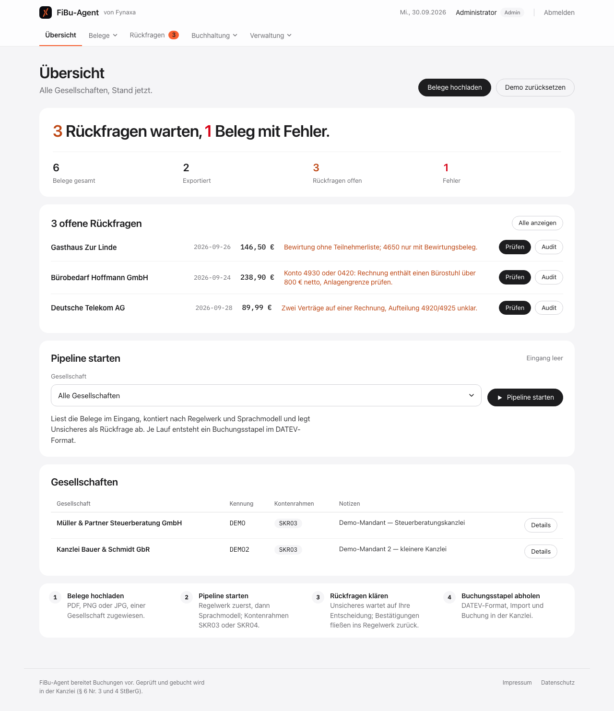

# FiBu-Agent

Laufende Buchführung vom Belegeingang bis zur DATEV-fertigen Buchungsdatei, als
vorbereitende Arbeit für eine Steuerkanzlei. Ein Beleg kommt per Mail, Upload
oder Ordner herein, wird gelesen, kontiert, geprüft und als DATEV-Buchungsstapel
exportiert. Was das System nicht sicher zuordnen kann, landet in einer
Rückfrage-Queue statt im Export.

**Status, offen gesagt:** Das ist ein Produktprototyp für Steuerkanzleien, der
einen Pilotlauf mit Testbelegen durchlaufen hat. Einen zahlenden Kunden gab es
nicht; der Markt wurde nach dem Piloten nicht weiterverfolgt. Der Prototyp läuft
trotzdem seit Wochen als Docker-Dienst hinter nginx unter
**https://app.fynaxa.de** (Login; ein Demo-Zugang mit erfundenen Belegen wird auf Anfrage
an info@fynaxa.de am selben Tag vergeben).

Zur Historie: Der Code entstand Juni und Juli 2026 als Pilot in einem privaten
Repository; die Commit-Historie hier beginnt mit der Veröffentlichung am
30.09.2026, nichts ist rückdatiert.

|  |  |
|---|---|
| Umfang | 10.300 Zeilen Python in 43 Dateien: 27 Werkzeugmodule, Flask-Oberfläche mit 52 Routen und 25 Vorlagen |
| Tests | **31**, laufen offline ohne API-Zugang |
| Kontierung | 4 Stufen: bestätigte Lieferanten aus dem Gedächtnis (ab zehn Bestätigungen ohne Rückfrage), dann 93 Regeln SKR03 bzw. 42 Regeln SKR04 (längstes Muster gewinnt), dann Sprachmodell, dann Rückfrage ab Konfidenz unter 0,7 |
| Betrieb | Docker Compose mit nginx, Healthcheck, `restart: unless-stopped`, Tagesbudget für API-Kosten |
| Orchestrierung | 14 n8n-Workflows mit 128 Knoten, als Export im Repository |
| Abhängigkeiten | Flask, pdfplumber, anthropic, cryptography, bcrypt, flask-limiter, apscheduler |



## Oberfläche

Weiße Karten auf hellem Grau, eine
Schrift (die Systemschrift, auf Apple-Geräten SF Pro), Kontrast über Größe und
Gewicht statt über Farbe. Schwarz ist Text und primäre Aktion, das Fynaxa-Orange
ist der einzige Akzent (aktiver Reiter, Rückfragen, Fokus), Rot gibt es nur für
Fehler. Die Übersicht beginnt mit einem Satz, der den Tag zusammenfasst („3
Rückfragen warten, 1 Beleg mit Fehler."). Fünf Reiter statt dreizehn: Übersicht, Belege,
Rückfragen; Buchhaltung und Verwaltung als Ausklappmenüs, die nur Administratoren
sehen. Beim Seitenaufruf geht keine Anfrage an
Google; die einzige Webschrift (IBM Plex Mono für Kennungen) liegt im Repository.
Weitere Ansichten: [Anmeldung](docs/screenshots/anmeldung.png),
[Rückfragen mit Sammelbestätigung](docs/screenshots/rueckfragen.png),
[Ausklappmenü](docs/screenshots/menue.png).

## Was hier nicht liegt

Keine Belege, keine Datenbank, keine Zugänge, keine Kanzleidaten. `.env`,
`*.db` sowie `inbox/`, `outbox/` und `archiv/` sind ausgeschlossen. Die
Mandanten in `workflows/mandanten.json` und die Belege in `tests/testbelege/`
sind erfunden. Die Demo-Zugangsdaten stehen bewusst nicht hier: Hinter dem
Login läuft ein bezahlter API-Zugang, budgetgedeckelt, aber ein öffentliches
Passwort dazu wäre eine Einladung.

## Ablauf

```
Beleg (IMAP-Postfach, Watchfolder oder Upload)
  → Extraktion      pdfplumber, bei Bildern Claude Vision
  → Kontierung      1. Lieferanten-Gedächtnis (ab zehn Bestätigungen ohne Rückfrage)
                    2. Regel aus skr03_rules.json (Lieferant, Verwendungszweck)
                    3. Sprachmodell mit Kontenrahmen als Kontext
                    4. Rückfrage-Queue, wenn Konfidenz < 0,7
  → Validierung     Pflichtfelder, Betrags- und MwSt-Plausibilität, Dublettencheck
  → Export          DATEV-Buchungsstapel (EXTF, CSV), eine Datei je Lauf
  → Bericht         Tageszusammenfassung: verarbeitet, exportiert, offen
```

Dazu Module, die im Alltag einer Kanzlei anfallen und die der Pilot mitgenommen
hat: Bankabgleich, Debitoren und offene Posten, Mahnwesen, Anlagenbuchhaltung,
EÜR, Umsatzsteuer-Voranmeldung, E-Rechnung, Audit-Log, Verschlüsselung der
Ablage, Sicherung, Kostenverfolgung je API-Aufruf.

## Warum vorbereitend und nicht ersetzend

Buchführung für Dritte ist in Deutschland Vorbehaltsaufgabe der steuerberatenden
Berufe. § 6 Nr. 3 und 4 StBerG erlauben Dritten nur das Buchen laufender
Geschäftsvorfälle und die vorbereitende Arbeit. Deshalb erzeugt das System einen
Stapel, der in der Kanzlei geprüft und gebucht wird, und stellt selbst nichts
fest. Das ist keine technische Grenze, sondern eine rechtliche, und sie steht im
Code als Aufteilung: Das System bereitet vor, die Kanzlei entscheidet.

Die Unterlagen dazu liegen in `docs/legal/`: Verfahrensdokumentation nach GoBD,
Auftragsverarbeitungsvertrag, Löschkonzept, Datenschutzerklärung, AGB,
Haftungsausschluss. Sie sind Teil des Produkts, nicht Beiwerk, weil ohne
Verfahrensdokumentation kein Prüfer den Export akzeptiert.

## Betrieb

`docker-compose.yml` startet den Dienst und nginx davor. Der Dienst prüft sich
selbst unter `/health` und liefert `503`, sobald einer der letzten fünf
Pipeline-Läufe einen Fehler hatte. Das ist streng gemeint: Ein Buchhaltungslauf,
der leise scheitert, ist schlimmer als einer, der laut ausfällt.

API-Kosten werden je Aufruf mitgeschrieben (`tools/cost_tracker.py`) und gegen
ein Tages- und Monatsbudget aus der `.env` geprüft. Ist das Budget erreicht,
stoppt die Pipeline, statt weiterzukontieren.

```
cp .env.example .env            # Schlüssel und Budget eintragen
docker compose up -d
python -m pytest tests/         # 31 Tests, kein Netz nötig
```

## n8n

`n8n/workflows/` enthält 14 exportierte Workflows, die den Dienst von außen
orchestrieren: Pipeline-Trigger alle 30 Minuten, Kontierungsregeln lernen per
Webhook, Uptime-Prüfung, nächtliche Sicherung, Mahnwesen, Onboarding,
Monatsrechnung, Tagesreport. Die Exporte enthalten nur Credential-Namen, keine
Werte; die Anleitung zum Aufsetzen steht in `n8n/setup-anleitung.md`.

## Bewusst nicht gebaut

Kein eigener Jahresabschluss · keine Steuererklärung · kein direkter Import in
DATEV-Systeme (der Stapel wird von der Kanzlei importiert) · kein automatisches
Buchen ohne Kanzleifreigabe · keine Verarbeitung von Lohndaten über das hinaus,
was der Kontenrahmen verlangt.
